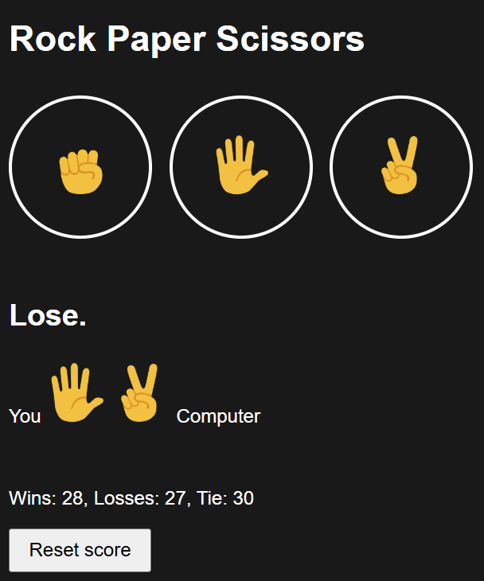

# Rock Paper Scissors
 

 
**[→ Live Demo](http://89.167.40.206/rock-paper-scissors/)**

 
A browser-based Rock Paper Scissors game built with vanilla HTML, CSS and JavaScript.
 

 
## Features
 
- Play against the computer
- Score tracking (Wins, Losses, Ties)
- Score persists across sessions via `localStorage`
- Hosted by me
## Tech Stack
 
`HTML` `CSS` `JavaScript`
